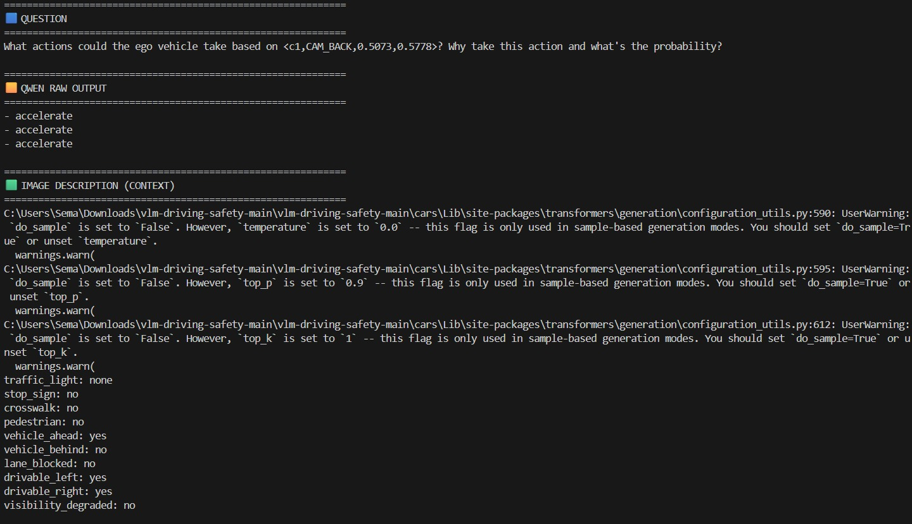
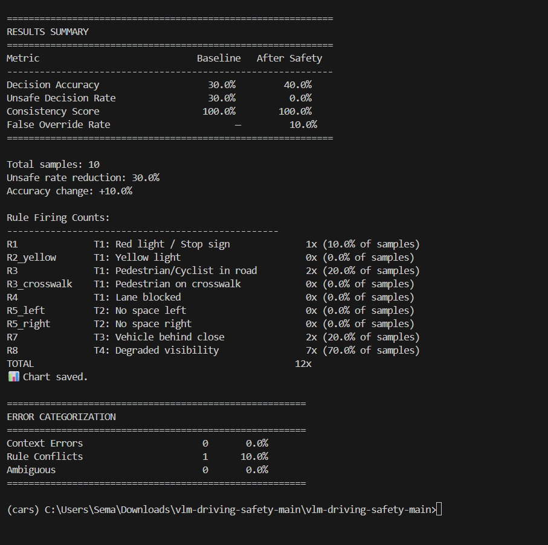

# Safety-Aware Post-Processing for Reliable VLM Driving Decisions

## Project Overview
This project presents a safety-aware post-processing framework that improves the reliability of Vision–Language Models (VLMs) for autonomous driving decision-making.

VLMs can analyze driving scenes and generate high-level actions such as keep speed or brake gently. However, these models are:
- stochastic (inconsistent across runs)
- not safety-aware (may violate traffic rules)

To address this, we introduce a lightweight post-processing pipeline that:
- extracts structured scene context
- applies deterministic safety rules
- performs multi-run consistency voting

This improves both safety and accuracy without retraining the model.

## Version History
- v0 (Colab Version):
  - Implemented as a single notebook / script (safety_vlm_driving.py / Colab)
  - Used Google Drive paths and Colab environment
- v2 (Current Version):
  - Fully modular Python project
  - No Colab dependencies
  - Clean structure and reproducible locally


### Build
No compilation is required. The project runs directly using Python scripts.
## Sample Input and Output

Sample Input:
- Image from DriveBench dataset
- Question: "What should the vehicle do?"

Sample Output:
{
  "baseline_final": "accelerate",
  "safe_final": "keep speed",
  "any_override": true,
  "fired_rules": ["R8"]
}
## Key Features
- No model retraining required  
- Model-agnostic (works with any VLM)  
- Fully explainable rule-based decisions  
- Multi-query consistency (K=3)  
- Error analysis and visualization  
- Separate demo script for qualitative evaluation  

## Hardware Requirements
- GPU recommended: NVIDIA A100 / RTX 3090 (≥16GB VRAM)
- Minimum: GPU with ≥12GB VRAM
- CPU-only execution is possible but very slow

## Software Requirements
- Python 3.10+
- PyTorch
- HuggingFace Transformers
- datasets

## Environment Setup (Recommended)

To avoid dependency conflicts, it is recommended to create a virtual environment before installing the requirements.

### Create virtual environment
```bash
python -m venv cars
```

### Activate environment

**Windows:**
```bash
cars\Scripts\activate
```

**Linux / Mac:**
```bash
source cars/bin/activate
```

### Install dependencies
```bash
pip install -r requirements.txt
```

## Project Structure
vlm-driving-safety/

├── main.py  
├── demo.py  
├── inference.py  
├── safety_rules.py  
├── consistency.py  
├── utils.py  
├── metrics.py  
├── data/DriveBench/  
├── results/  
├── requirements.txt  
├── README.md  
Each module handles a specific part of the pipeline:
- inference.py → model and prompts
- safety_rules.py → rule-based filtering
- consistency.py → majority voting
- metrics.py → evaluation and plots
## Data Sources
- Questions / metadata → HuggingFace  
- Images → Google Drive download (see below)

## Dataset Setup

Due to size limitations, images are NOT included in this repository.

### Step 1: Dataset Metadata (Automatic)

The metadata (questions and annotations) is loaded automatically from HuggingFace:

```python
from datasets import load_dataset
dataset = load_dataset("drive-bench/arena")
```

---

### Step 2: Download Images (Required)

Download the image dataset manually from Google Drive:

https://drive.google.com/file/d/1ZiHWqOkSZjXWYYzCKUrhPlgjv4eIJsph/view

---

### Step 3: Extract and Place Dataset

After downloading, extract the zip file and place it in the following directory:

```
data/DriveBench/Brightness/
```

Final structure must look like:

```
data/DriveBench/Brightness/
├── CAM_FRONT/
├── CAM_BACK/
├── CAM_FRONT_LEFT/
├── CAM_FRONT_RIGHT/
├── CAM_BACK_LEFT/
├── CAM_BACK_RIGHT/
```

 Important:

* Do NOT keep the zip file compressed
* Make sure image paths match exactly
* Incorrect structure will result in "unknown" outputs during inference


### Preprocessing

- Filter only planning questions
- Remove collision-related questions
- Extract camera from question
- Match image files with dataset metadata
## How to Run

### Full Evaluation Pipeline
python main.py

This will:
- load dataset from HuggingFace
- run VLM inference (K=3)
- apply safety rules
- compute metrics
- generate plots
- save results

## Output Files

Saved in:
results/

Includes:
- vlm_results.json → full results  
- vlm_results_chart.png → metrics plot  
- vlm_error_categorization.png → error analysis  

## Qualitative Demo

Run:
python demo.py

This runs one sample and shows:
- Question  
- Qwen raw outputs  
- Image description (context)  
- Safety rules applied  
- Final decision  
- Summary

## Original Colab Version (v0)

The first version of this project was implemented as a single Google Colab notebook:

- File: `safety_vlm_driving.ipynb`

This version includes:
- Full pipeline implementation in one script  
- Google Drive integration for dataset loading  
- Inline evaluation, visualization, and analysis  

The current repository (v2) refactors this into a clean modular Python project.

---

## JSON Output Explanation

Each sample produces a structured JSON output containing both baseline and safety-refined decisions.

### Example
```json
{
  "baseline_final": "accelerate",
  "safe_final": "keep speed",
  "any_override": true,
  "fired_rules": ["R8"]
}
```

### Explanation

- **baseline_final** → The original action predicted by the VLM  
- **safe_final** → The final action after applying safety rules  
- **any_override** → Indicates whether the safety layer changed the original decision  
- **fired_rules** → List of safety rules that were triggered (e.g., R8 = degraded visibility)  

This structure ensures full transparency and explainability of the system decisions.

## Pipeline Overview
Image + Question  
→ Qwen2-VL Model (K=3 runs)  
→ Context Extraction  
→ Safety Rules Layer  
→ Consistency Voting  
→ Final Safe Decision  

## Evaluation Metrics
- Decision Accuracy  
- Unsafe Decision Rate  
- False Override Rate  
- Consistency Score  

## Error Analysis
- Context Extraction Errors  
- Rule Conflicts  
- Ambiguous Scenes  

Example:
{
  "baseline_final": "accelerate",
  "safe_final": "keep speed",
  "any_override": true,
  "fired_rules": ["R8"]
}


## Sample Input / Output (Qualitative Examples)

Below are examples showing how the safety layer improves VLM decisions.

### Example 1 – Safety Correction


- **Qwen Raw:** accelerate ❌  
- **After Safety:** keep speed ✅  
- **Rule Applied:** R8 (degraded visibility)

---

### Example 2 – False Override Case


- **Qwen Raw:** keep speed ✅  
- **After Safety:** brake gently ❌  
- **Rules Applied:** R8, R1, R7  

This demonstrates a rare **false override case**.

---

## Demo Run (Single Sample)

Below is an example output when running:

```bash
python demo.py
```



### Key Observations
- Model produces **consistent raw outputs (K=3)**
- Context is extracted in structured format
- Safety rules refine unsafe actions
- Final decision is selected via consistency voting

---

## Full Pipeline Run (Evaluation Output)

Below is a snapshot of the full evaluation pipeline:

```bash
python main.py
```



### Results Summary
- **Unsafe Decision Rate:** reduced significantly  
- **Accuracy:** improved after safety layer  
- **Consistency:** maintained at 100%  
- **Rule activations:** provide explainability  

---

## Error Analysis Example


### Observations
- Very low context extraction errors  
- Small number of rule conflicts (~2–10%)  
- Most decisions are correctly refined  

---

## Notes

- Images are stored in the `images/` folder inside the repository  
- File names can be adjusted as needed  
- These visualizations demonstrate the effectiveness of the safety layer  


## Sample Results
- Unsafe Rate reduced: 30.5% → 1.5%  
- Accuracy improved: 43.3% → 57.9%  
- False override rate: 2.8%  

## Reproducibility
- Install dependencies  
- Download dataset from Google Drive  
- Place dataset in: data/DriveBench/Brightness/
- Run:
  python main.py  
  python demo.py  

## Limitations
- Depends on VLM context extraction quality  
- Rule-based system is not fully scalable  
- Single-frame only  
- Dataset limited (~400 samples)  

## Authors
- Nadia Badawi  
- Sema Helali  
- Kisaa Fatima Muhammad  
- Hailemariam Teshager  
